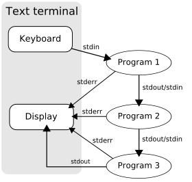

# I/0重定向原理与实现

### I/O重定向的原理与实现
在Unix系统中，每个进程都有```STDIN```、```STDOUT```和```STDERR```这3种标准I/O，它们是程序最通用的输入输出方式。几乎所有语言都有相应的标准I/O函数，比如，C语言可以通过scanf从终端输入字符，通过printf向终端输出字符。熟悉Shell的朋友都知道，我们可以方便地对Shell命令进行I/O重定向，比如 ```find -name "*.java" >testfile.txt``` 把当前目录下的Java文件列表重定向到```testfile.txt```。多数情况下，我们只需要了解I/O重定向的使用就够了，但是如果要编程实现类似Shell的I/O重定向以及管道功能，那么就需要清楚它的原理和实现。

下面本文就以Linux系统为具体例子，介绍I/O重定向的原理和实现（文中实验环境为Ubuntu 12.04，内核版本3.2.0-59）。

### 文件描述符表
理解I/O重定向的原理需要从Linux内核为进程所维护的关键数据结构入手。对Linux进程来讲，每个打开的文件都是通过文件描述符(File Descriptor)来标识的，内核为每个进程维护了一个文件描述符表，这个表以FD为索引，再进一步指向文件的详细信息。在进程创建时，内核为进程默认创建了0、1、2三个特殊的FD，这就是STDIN、STDOUT和STDERR，如下图所示意：

所谓的I/O重定向也就是让已创建的FD指向其他文件。比如，下面是对STDOUT重定向到testfile.txt前后内核文件描述符表变化的示意图

重定向前：

重定向后：


在I/O重定向的过程中，不变的是FD 0/1/2代表STDIN/STDOUT/STDERR，变化的是文件描述符表中FD 0/1/2对应的具体文件，应用程序只关心前者。本质上这和接口的原理是相通的，通过一个间接层把功能的使用者和提供者解耦。

下面我们通过strace命令跟踪一下echo命令的系统调用：

```bash
dagang@ubuntu12:~$ strace echo hello 2>&1 >/dev/null | grep write
write(1, "hello\n", 6)                  = 6```
我们可以看到 write(1, "hello\n", 6) 这样一个系统调用，它的第一个参数1就是代表的STDOUT的FD，这说明对于echo程序，它只管（通过标准I/O函数从STDOUT）向FD 1写入，而不关心它们FD 1到底对应的是哪个文件。

Shell正是通过I/O重定向和管道这种特殊的文件把多个程序的STDIN和STDOUT串联在一起组成更复杂功能的，下面是Shell中通过管道的示意图：



下面我们用一个实际的例子来体验一下：

```bash
dagang@ubuntu12:~$ sleep 30 | sleep 40 &
[1] 5584
dagang@ubuntu12:~$ pgrep -l sleep
5583 sleep
5584 sleep
dagang@ubuntu12:~$ ll /proc/5583/fd
total 0
lrwx------ 1 dagang dagang 64 Feb 27 13:41 0 -> /dev/pts/3
l-wx------ 1 dagang dagang 64 Feb 27 13:41 1 -> pipe:[246469]
lrwx------ 1 dagang dagang 64 Feb 27 13:41 2 -> /dev/pts/3
dagang@ubuntu12:~$ ll /proc/5584/fd
total 0
lr-x------ 1 dagang dagang 64 Feb 27 13:41 0 -> pipe:[246469]
lrwx------ 1 dagang dagang 64 Feb 27 13:41 1 -> /dev/pts/3
lrwx------ 1 dagang dagang 64 Feb 27 13:41 2 -> /dev/pts/3```
上面我们启动了两个进程5583和5584，通过查看```/proc//fd```，我们看到进程5583的```STDOUT```和**5584**的**STDIN**被重定向到了```pipe:[246469]```，这样就达到了连接两个进程标准I/O的目的。


### dup2()系统调用

上面介绍了文件描述符表和I/O重定向的原理，那么在Linux系统中如何通过C程序实现I/O重定向呢？主要用到了dup2()这个系统调用，man中关于dup2是这样说的：

> ```c
> int dup2(int oldfd, int newfd);```

> dup2() create a copy of the file descriptor oldfd. After a successful return from dup() or dup2(), the old and new file descriptors may be used interchangeably. They refer to the same open file description (see open(2)) and thus share file offset and file status flags; for example, if the file offset is modified by using lseek(2) on one of the descriptors, the offset is also changed for the other.

这里我们通过一个实际的问题来说明它的使用方法：

编写一个C程序，通过调用sort这个Shell命令进行排序，要求把in.txt和out.txt分别重定向到sort的STDIN，STDOUT。
参考实现：
```c
int main() {
    int pid = 0;
    // fork a worker process
    if (pid = fork()) {
        // wait for completion of the child process
        int status; 
        waitpid(pid, &status, 0);
    }
    else {
        // open input and output files
        int fd_in = open("in.txt", O_RDONLY);
        int fd_out = open("out.txt", O_CREAT | O_RDWR, S_IRUSR | S_IWUSR | S_IRGRP | S_IROTH);
        if (fd_in > 0 && fd_out > 0) {
            // redirect STDIN/STDOUT for this process
            dup2(fd_in, 0);
            dup2(fd_out, 1);  
            // call shell command
            system("sort");
            close(fd_in);
            close(fd_out);
        }
        else {
            // ... error handling
        }
    }
    return 0;
}```

上面的主要步骤包括：

1. 首先fork一个子进程，后续步骤都在子进程中完成，父进程通过waitpid()系统调用等待子进程结束；
2. 打开open()系统调用打开in.txt和out.txt，得到它们的描述符（在我的测试中，这两个值通常为3和4）；
3. 通过dup2()系统调用把STDIN重定向到fd_in，把STDOUT重定向到fd_out（注意，重定向的影响范围是整个子进程）；
4. 通过system()系统调用运行shell命令sort

通过上面的例子我们就了解最基本的I/O重定向的实现方法，接下来，你能否根据这些知识进一步实现出Shell的管道特性呢？


### 总结


本文介绍了Linux系统I/O重定向的原理和实现方式。原理方法最重要的是理解文件描述符和文件描述符表的概念，以及标准I/O所对应的特殊FD；实现方面主要是了解dup2()系统调用的功能和用法。最后需要注意的是dup2()不仅可以用来对标准I/O重定向，对任何FD都是可以的，这是习惯使用Shell进行标准I/O重定向的朋友容易忽略的。